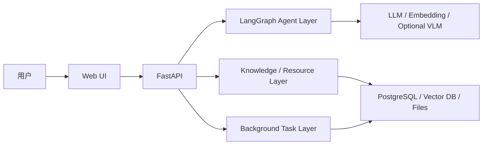

# 中国软件杯 A1/A2/A3 选题与技术方案建议

更新时间：2026-04-17  
依据：已核对当前目录保存的第十五届比赛通知与 A1/A2/A3 官方题面 HTML 原文。  
适用对象：2 人团队，Python/深度学习基础较好，LLM/RAG/Agent 有理论基础但缺少完整工程实战，前后端经验较弱。

## 0. 这次修订后的核心结论

和我上一次只根据题目标题做判断相比，这次基于你本地保存的官方题面核对后，**结论发生了明显变化**：

1. **首选从 A1 改为 A3**
2. **A1 从首选降为第二选择**
3. **A2 仍然不建议优先做**

最关键的原因不是题目“听起来难不难”，而是官方题面里存在明确的**工程硬约束差异**：

- **A1** 明确要求：
  - 采用 **B/S 架构**
  - 软件需部署在 **LoongArch 架构 + 银河麒麟高级服务器版 V11/V10**
  - **不满足该要求视为 0 分**
- **A2** 也明确要求：
  - 采用 **B/S 架构**
  - 软件需部署在 **LoongArch 架构 + 麒麟高级服务器版 V11**
  - 还要实现 **MCP、最小权限、安全护栏、Prompt Inject 防御、闭环日志**
- **A3** 则明显更灵活：
  - 对开发环境、语言、数据库、硬件平台**不做硬性限制**
  - 允许 Web、移动端、小程序等多种形态
  - 重点是多智能体、个性化资源生成、学习路径和文档表达

所以，基于你们现在的能力画像，真正最稳的排序应该是：

> **A3 > A1 > A2**

同时，我比上次更明确地建议：

> **不要做“前后端分离的微服务架构”作为第一阶段目标。**

对你们这种 2 人队伍，比赛项目更适合：

- 架构思想上模块化
- 部署形态上轻量化
- 先做成 **模块化单体 / 轻服务化系统**
- 等闭环跑通后，再考虑是否拆成多个服务

---

## 1. 已核对的第十五届比赛信息

根据你本地保存的《**关于举办第十五届“中国软件杯”大学生软件设计大赛的通知**》，我确认到以下关键信息：

### 1.1 参赛对象与组队规则

- 面向全日制普通高等院校在籍学生
- A 组可由：
  - 本科生
  - 研究生及以上学历
  - 中职/高职/职业本科
 参赛
- 以组队形式报名
- **每队成员不超过 4 名**
  - 含队长 1 名
  - 指导教师 1 名
  - 其他队员不超过 2 名

也就是说，你们现在 **2 名学生组队是完全合规的**。

### 1.2 时间安排

这里要特别纠正我上一次回答里引用的 2025 年信息。  
你们现在本地保存的是 **2026 年第十五届** 官方通知，关键时间是：

- 报名阶段：**2026-03-24 到 2026-06-30**
- 辅导阶段：拟定 **2026-03-24 到 2026-06-30**
- 作品提交截止：**暂定 2026-06-30 15:00**
- 初赛评审：拟于 **2026 年 7 月**
- 总决赛及颁奖：拟于 **2026 年 8 月**

所以你们当前应该按照 **2026-06-30 15:00** 这个绝对时间来倒排计划。

### 1.3 比赛作品通用要求

官方通知明确强调：

- 作品必须是**本届大赛期间完成的原创作品**
- 不得抄袭、重复参赛、一稿多投
- 软件作品需符合软件工程规范
- 编程风格、注释、文档要完整

---

## 2. 三道题的官方题意核对与重新解读

## 2.1 A1：基于多模态大模型技术的设备检修知识检索与作业系统

### 官方题意要点

A1 的官方题面比题目标题更明确，核心不是“做个设备问答机器人”，而是做一个**检修知识检索 + 标准化作业辅助系统**。

题面明确要求它解决的问题包括：

- 检修知识分散
- 检索低效
- 作业不规范
- 经验传承难

官方给出的典型能力要求包括：

1. **B/S 架构**
2. **必须部署在 LoongArch + 银河麒麟高级服务器版 V11/V10**
3. 支持本地部署大模型服务或云端大模型服务
4. 支持 **文本、故障图片、设备型号** 等多类型输入
5. 实现多模态知识检索与跨模态匹配
6. 提供**标准化作业指引**
7. 支持**知识沉淀与更新**
8. 允许人工标注、人工修正模型输出
9. 题面还明确提到了**知识图谱**

### A1 的真实难点

上次我说 A1 适合你们，这个判断只对了一半。  
现在看了官方题面后，A1 的风险其实比我上次判断的更高，因为它不是一般的 RAG Demo，而是同时要求：

- 多模态检索
- 作业流程指引
- 知识持续更新
- 一定程度的知识图谱
- **LoongArch + 银河麒麟部署落地**

这意味着 A1 的难点来自两部分：

1. **AI 功能链路**
2. **国产算力/OS 环境适配**

### A1 对你们的适配度

优点：

- 场景聚焦，评委容易理解
- 你们的 LLM/RAG 基础能直接用上
- 结果容易演示

风险：

- LoongArch + 银河麒麟是硬约束
- Python 生态包在该环境下的可用性要尽早验证
- “知识图谱 + 多模态 + 作业系统”会把需求拉宽

### 对 A1 的重新结论

**A1 仍然是可做题，但不再是最优先选择。**  
如果你们能在 1 周内确认：

- 能拿到远程开发环境
- 能在目标环境顺利跑通 Python、FastAPI、模型调用、向量库客户端
- 能获取一批像样的设备文档/图片数据

那么 A1 依然值得做。否则它会成为“环境问题吃掉研发时间”的高风险题。

---

## 2.2 A2：面向麒麟操作系统的安全智能运维 Agent 设计与实现

### 官方题意要点

A2 官方题面比标题更明确，而且比我上次预估得还要“硬核”。

明确要求包括：

1. **B/S 架构**
2. 部署在 **LoongArch + 麒麟高级服务器版 V11**
3. Agent 要作为自然语言与 OS 交互的桥梁
4. 要实现 **MCP（Model Context Protocol）**
5. 要具备 OS 深度感知能力
   - 例如 `lsof`、`netstat`、`journalctl`
6. 要将常用运维动作插件化为 Agent Tools
7. 要有**安全意图校验器**
8. 要有**最小权限执行**
9. 要有**可追溯推理闭环日志**
10. 非功能上强调：
   - 未授权不能修改关键配置
   - 能识别 **Prompt Inject**

### A2 的真实难点

A2 的难点不是“做一个聊天运维助手”，而是：

> 做一个能调用系统工具、同时又要足够安全、可控、可审计的 OS 运维 Agent。

而且官方评分也高度偏向这些能力：

- 功能完整性 55%
  - OS 感知
  - MCP
  - 自然语言交互准确性
  - 安全护栏
  - 根因分析

这意味着 A2 的评分重心不在界面，而在：

- 系统能力
- 工具链设计
- 安全机制
- 可信执行

### A2 对你们的适配度

对你们当前背景来说，A2 有四重门槛：

- Linux/OS 运维知识
- 麒 麟/LoongArch 环境经验
- Agent 工具调用与权限隔离
- 安全防护机制设计

这是三道题里**实现风险最高**的一题。

### 对 A2 的重新结论

**不建议优先做。**  
除非你们团队里有 1 人已经比较熟悉：

- Linux 运维
- OS 命令/日志
- 账号权限管理
- 系统安全

否则这题很容易做成“看起来很炫，但缺乏可信性”的作品。

---

## 2.3 A3：基于大模型的个性化资源生成与学习多智能体系统开发

### 官方题意要点

A3 的官方题面非常详细，而且比标题更“可工程化”。

它要求的核心不是泛泛地做教育 Agent，而是：

1. 围绕**某一门具体课程**
2. 构建至少一门完整高校课程的初始知识库/文档集
3. 做出**个性化资源生成系统**
4. 明确采用**多智能体协同框架**
5. 实现至少 **5 类个性化资源生成**
6. 做出动态画像、路径规划、资源推荐

题面明确给出的核心功能要求包括：

### 必做项

1. **对话式学习画像构建**
   - 不是填表，而是通过自然语言对话构建学生画像
   - 画像不少于 **6 个维度**
   - 画像可动态更新

2. **多智能体协同资源生成**
   - 系统必须体现“多智能体”架构
   - 至少生成 **5 种类型** 的个性化资源
   - 资源示例包括：
     - 讲解文档
     - 知识点思维导图
     - 练习题
     - 拓展阅读
     - 多模态教学视频/动画
     - 代码实操案例

3. **个性化学习路径规划与资源推送**

### 可选加分项

4. 智能辅导
5. 学习效果评估

### 非功能要求

A3 的非功能要求也很关键：

- UI 要符合现代 AI 产品交互规范
  - 流式输出
  - Markdown 渲染
  - 卡片化多模态内容展示
- 要有“防幻觉”和内容安全过滤机制
- 响应时间要合理，避免长时间白屏
- 如使用开源项目、AI 工具、AI Coding 工具，要在文档中说明

### A3 的真实难点

A3 看似开放，但真正难点在于：

- 必须是**一门具体课程**
- 必须真做“个性化”
- 必须真做“多智能体”
- 必须至少 5 类资源
- 文档与演示表达要求很高

### A3 对你们的适配度

A3 现在反而是最匹配你们现状的一题，因为它：

- **没有 LoongArch / 麒麟部署硬约束**
- 允许你们用熟悉的 Python 技术栈
- 允许你们把重点放在多智能体、内容生成、画像和资源组织上
- 数据可以自建，不像 A1 那样强依赖工业垂类真实数据

### 对 A3 的重新结论

**A3 现在应该是首选。**

---

## 3. 修正后的选题排序

## 最终排序

1. **A3：首选**
2. **A1：第二选择**
3. **A2：不建议优先**

## 为什么排序改变了

我上次把 A1 放第一，主要因为它和你们的 RAG/LLM 基础更贴近。  
但这次看了官方题面后，A1/A2 都有明确的 **LoongArch + 麒麟部署硬约束**，而 A3 没有。

对你们这种：

- 2 人团队
- Python 强、前后端弱
- 没有国产 OS/CPU 部署经验

的组合来说，真正决定胜负的不是“题目方向本身”，而是：

- 能不能按时做完
- 能不能稳定演示
- 能不能把文档写扎实

从这个角度看，A3 的交付确定性最高。

---

## 4. 重新评估你们原本的技术路线

你们原本打算：

- 前端：Streamlit
- 后端：FastAPI + Uvicorn
- Agent：待定
- RAG：LangChain
- 架构：前后端分离 + 微服务

基于官方题面，现在我建议分情况讨论。

## 4.1 不建议当前就做微服务

这个结论比上次更坚定。

原因：

- A1/A2 还要解决 LoongArch/麒麟适配
- A3 还要解决多智能体与内容生成闭环
- 2 人团队没有余量花在：
  - 服务治理
  - 多容器联调
  - 网关
  - 配置中心
  - 服务拆分

### 最推荐的实现方式

**模块化单体 + 轻服务化部署**

具体就是：

- 逻辑上按模块拆
- 部署上尽量少进程
- 如果确实需要再拆 worker

推荐形态：

- 1 个 Web 前端
- 1 个 FastAPI 后端
- 1 个可选后台任务进程

而不是一开始就拆：

- 用户服务
- 检索服务
- Agent 服务
- 文件服务
- 任务服务
- 日志服务

---

## 4.2 Streamlit 还能不能用

### 如果你们选 A3

**可以继续用 Streamlit。**

原因：

- A3 没有指定运行在 LoongArch/麒麟上
- 对交互形态限制少
- Streamlit 很适合：
  - 对话式画像
  - 资源卡片展示
  - Markdown 输出
  - 多页原型
  - 演示型 Web 产品

所以：

> **A3 场景下，Streamlit 是可接受且高性价比的选择。**

### 如果你们选 A1 或 A2

我不再建议默认使用 Streamlit。

不是因为 Streamlit 一定不行，而是因为：

- 官方要求部署到 **LoongArch + 麒麟**
- 你们当前并没有完成该环境验证
- Python 生态在该环境上的兼容性需要实测

所以 A1/A2 下更稳的策略是：

1. **先验证环境兼容性**
2. 如果 Streamlit 能稳定跑，再决定是否使用
3. 如果不稳定，优先退回：
   - FastAPI + Jinja2/HTMX
   - 或 FastAPI + 极简前端模板

### 对 Streamlit 的修正建议

- **A3：推荐**
- **A1：可选，但必须先验证 LoongArch/麒麟兼容**
- **A2：不推荐作为首要方案**

---

## 4.3 Agent 框架怎么选

这次看完题面后，我的建议更明确：

- **A3：LangGraph**
- **A1：LangGraph**
- **A2：LangGraph + MCP 相关实现**

### 为什么仍然推荐 LangGraph

因为三道题里，真正要做的都不是“自由对话聊天”，而是：

- 有状态流程
- 多步骤编排
- 角色分工
- 工具调用
- 人工确认或规则校验

这都更适合 LangGraph，而不是“一个黑盒 Agent 自己乱调工具”。

### 和 LangChain 的关系

建议保留 LangChain，但不要让它承担整个 Agent 编排：

- **LangChain**：模型接入、Prompt、检索链、工具包装
- **LangGraph**：状态机、流程节点、多智能体编排

---

## 4.4 RAG 框架怎么选

### A3

A3 虽然不是纯 RAG 题，但也需要知识库支撑。  
你们可以继续使用：

- **LangChain**
- 或 **LlamaIndex**

如果你们已经开始接触 LangChain，就没必要中途强切。

### A1

A1 官方题面已经不仅是普通向量检索，而是：

- 多模态检索
- 作业指导
- 知识沉淀更新
- 知识图谱

所以 A1 不建议只做“文本切块 + 向量库 + 生成回答”。

更合理的是：

- 向量检索
- 元数据过滤
- 轻量知识图谱/关系图
- 人工修正回写

### 是否继续用 LangChain

**可以继续用。**  
但你们要意识到：

- LangChain 只是工具层
- 真正决定效果的是：
  - chunk 策略
  - 检索策略
  - rerank
  - 结构化输出
  - 评测数据

---

## 5. 各题目的技术选型建议

## 5.1 如果选 A3：推荐技术栈

这是我现在最推荐的一套：

- 前端：**Streamlit**
- 后端：**FastAPI**
- Agent 编排：**LangGraph**
- RAG/模型工具层：**LangChain**
- 向量库：**Qdrant** 或 **pgvector**
- 元数据数据库：**PostgreSQL**
- 文件存储：本地文件系统
- 异步任务：FastAPI BackgroundTasks
- 可观测性：Langfuse 或简单日志面板

### 为什么这套适合 A3

- 全 Python 栈，符合你们能力边界
- 研发速度快
- 支持聊天式交互
- 支持多智能体编排
- 支持资源生成卡片化展示

---

## 5.2 如果选 A1：推荐技术栈

前提：**先通过 LoongArch + 银河麒麟环境验证。**

建议技术栈：

- 前端：
  - 首选 **FastAPI + Jinja2/HTMX**
  - 或环境验证通过后使用 **Streamlit**
- 后端：**FastAPI**
- Agent 编排：**LangGraph**
- 检索层：**LangChain**
- 向量库：
  - 优先选客户端依赖轻的方案
  - 不要一上来就堆太多中间件
- 元数据/关系层：**PostgreSQL / SQLite**
- 图谱层：
  - 先做轻量设备知识关系图
  - 不建议上来就做重型图数据库

### A1 关键不是栈有多新，而是三件事

1. 环境能跑
2. 多模态检索有效
3. 作业流程闭环清晰

---

## 5.3 如果选 A2：仅做备胎方案

只有在你们确认要冲 A2 时，才考虑：

- 前端：极简 Web
- 后端：FastAPI
- Agent 编排：LangGraph
- MCP：官方/兼容 Python 实现
- 工具执行：受限账户 + 白名单命令 + 审计日志

但总体上，我还是不建议你们把 A2 作为主路线。

---

## 6. 三题对应的项目架构建议

## 6.1 统一的推荐架构思路

这是比赛项目最合适的复杂度。

### 架构原则

- 前台交互简单稳定
- 后台逻辑清晰可解释
- 模型调用链路可调试
- 数据层尽量收敛

---

## 6.2 A3 的推荐架构

### 核心模块

1. **画像 Agent**
   - 从对话中抽取学生画像
   - 维护至少 6 维动态画像

2. **课程分析 Agent**
   - 基于课程知识库提炼知识点结构

3. **资源规划 Agent**
   - 决定生成哪几类资源
   - 决定难度与路径顺序

4. **资源生成 Agent**
   - 生成文档、题目、思维导图、代码案例等

5. **审核/安全 Agent**
   - 检查幻觉、格式、违规内容

6. **推荐/路径 Agent**
   - 组合资源并生成学习路径

### 推荐资源类型

为了满足“至少 5 类个性化资源”，我建议你们优先选择**最好做且最稳**的五类：

1. 知识讲解文档
2. 章节要点总结卡片
3. 分层练习题
4. 代码实操案例
5. 知识点思维导图

第 6 类可选：

6. 拓展阅读资料

### 暂时不建议前期主打的视频/动画

虽然题面举了视频/动画例子，但对 2 人团队来说，视频生成成本高、调试复杂、演示不稳。  
你们完全可以先用更稳的 5 类资源把硬要求完成。

---

## 6.3 A1 的推荐架构

### 核心模块

1. 文档/图片接入模块
2. 多模态检索模块
3. 故障诊断与作业建议 Agent
4. 标准作业流程模块
5. 知识更新与审核模块
6. 轻量知识图谱模块

### A1 最值得做的闭环

1. 上传设备手册、维修案例、故障图片
2. 解析并建知识库
3. 输入故障现象/图片/设备型号
4. 多模态检索相关证据
5. 生成故障原因、排查步骤、注意事项
6. 输出标准化作业指引
7. 允许人工修正并回写知识库

### 对知识图谱的建议

题面提到了知识图谱，但对你们来说不应做成重型工程。  
建议做**轻量关系图谱**即可：

- 设备
- 部件
- 故障现象
- 原因
- 检修步骤
- 风险提示

用这个结构已经足够体现题意。

---

## 7. 重新评估后的学习路线

## 7.1 如果你们选 A3：学习优先级

### 第一优先级

1. FastAPI 基础
2. Streamlit 多页与聊天界面
3. LangGraph 多智能体编排
4. RAG 基础链路
5. PostgreSQL / 向量库基础

### 第二优先级

1. 课程知识库构建
2. Markdown/卡片化资源展示
3. 幻觉控制与内容审核
4. 评测与演示脚本

### 暂时不必深挖

- 真微服务
- 复杂前端框架
- K8s
- 复杂 CI/CD

---

## 7.2 如果你们选 A1：额外必须补的内容

除了上面那些，还必须补：

1. LoongArch / 麒麟环境验证
2. 多模态输入链路
3. 轻量知识图谱设计
4. 文档解析与知识回写机制

这也是为什么 A1 的成本会明显高于 A3。

---

## 8. 工作排期建议

由于你们距离截止时间是 **2026-06-30 15:00**，建议按“剩余开发周期”做倒排。  
如果现在开始，我建议按 **10 周左右** 来设计，其中前 2 周必须完成立项验证。

## 第 1 周：最终选题 + 环境验证

目标：

- 在 A3 和 A1 中最终二选一
- 如果保留 A1，必须完成：
  - LoongArch/麒麟环境可用性验证
  - Python 依赖可运行性验证

验收标准：

- 形成最终选题结论
- 有最小技术验证结果

## 第 2 周：最小闭环

### A3

- 聊天界面
- 画像抽取
- 知识库接入
- 输出 1 类资源

### A1

- 文档上传
- 基础检索
- 返回引用回答

## 第 3-4 周：核心能力成型

### A3

- 画像 6 维落地
- 多智能体分工跑通
- 至少 3 类资源生成

### A1

- 多模态检索
- 作业步骤输出
- 知识更新/回写

## 第 5-6 周：达到题面最低完成度

### A3

- 达到至少 5 类资源
- 个性化学习路径生成
- 基础 UI 完成

### A1

- 标准化作业指引
- 人工修正
- 轻量知识图谱展示

## 第 7-8 周：优化与评测

- 建测试样例
- 调整 Prompt、检索、Agent 流程
- 加强防幻觉
- 增加演示稳定性

## 第 9 周：文档与 PPT

补齐：

- 需求分析文档
- 功能设计文档
- 产品说明书
- 测试报告
- 安装部署文档
- PPT

## 第 10 周：录视频与冲刺

- 录制 7 分钟以内演示视频
- 修复 bug
- 固化演示环境

---

## 9. 两个人怎么分工最合理

仍然不建议你们一个人只做前端、另一个人只做算法。  
更适合的是按“业务纵切”分工。

## 成员 A：AI/知识库/评测主责

负责：

- 知识库构建
- 检索链路
- Prompt 设计
- 资源生成质量
- 评测样例与调优

## 成员 B：系统/交互/Agent 主责

负责：

- Web 页面
- FastAPI 接口
- LangGraph 编排
- 文件上传与任务状态
- 系统集成

## 两人共同负责

- 选题收敛
- Demo 脚本
- 文档撰写
- 视频录制
- 答辩准备

---

## 10. 这次核对后，需要明确修正的几条旧建议

## 修正 1：不再把 A1 作为默认首选

旧建议：

- 主推 A1

修正后：

- **主推 A3**
- A1 只有在你们尽早验证 LoongArch/麒麟环境后才建议保留

## 修正 2：Streamlit 不再是 A1/A2 的默认推荐

旧建议：

- 直接使用 Streamlit + FastAPI

修正后：

- **A3：可直接用 Streamlit**
- **A1/A2：必须先做环境兼容性验证**

## 修正 3：A1 不只是 RAG，要体现知识图谱与作业系统

旧建议里我已经提到作业系统，但这次要更强调：

- A1 的官方题面明确要求知识沉淀与更新
- 还点名知识图谱

所以 A1 不能做成“文档问答机器人”就算完成。

## 修正 4：A2 的风险比我上次估计的更高

因为官方题面把下面几项都写得很明确：

- MCP
- 最小权限
- Prompt Inject 防御
- 安全护栏
- 闭环日志

所以 A2 不是“可选的安全增强”，而是“安全本身就是主评分项”。

---

## 11. 给你们的最终决策建议

如果我是你们队里的技术负责人，现在我会这样拍板：

## 选题

- **首选 A3**
- **备选 A1**
- **放弃 A2**

## 架构

- **不做真微服务**
- **采用模块化单体**

## 技术栈

### 选 A3

- 前端：**Streamlit**
- 后端：**FastAPI**
- Agent：**LangGraph**
- RAG：**LangChain**
- 向量库：**Qdrant / pgvector**
- 数据库：**PostgreSQL**

### 选 A1

- 先验证 LoongArch/银河麒麟环境
- 再决定前端是否能用 Streamlit
- 后端仍建议 **FastAPI**
- Agent 仍建议 **LangGraph**

## 战略原则

- 先满足题面硬约束
- 先跑通闭环
- 先保证演示稳定
- 再谈架构美感

---

## 12. 立即可执行的下一步

你们本周最应该做的 6 件事是：

1. 在 **A3 和 A1** 之间做最终二选一。
2. 如果 A1 仍在候选内，立刻验证 **LoongArch + 麒麟** 环境能不能跑你们的 Python 方案。
3. 如果环境验证不顺，直接切 **A3**，不要犹豫。
4. 为 A3 选定一门具体课程，建议从你们更熟悉的方向入手。
5. 搭最小骨架：`frontend + backend + langgraph + vector store`。
6. 先只做一个最小闭环，再逐步补资源类型或高级功能。

### 对 A3 的具体选课建议

为了提高成功率，我建议你们选：

- **人工智能导论**
或
- **机器学习导论**

原因：

- 你们最熟悉
- 资料容易找
- 题目生成、代码案例、知识图谱、思维导图都好做

---

## 13. 一句话版本

基于你本地保存的第十五届官方题面重新核对后，**最推荐你们选 A3，不建议做微服务，A3 可以用 Streamlit + FastAPI + LangGraph + LangChain；A1 只有在你们尽快验证 LoongArch/银河麒麟环境后才值得继续保留，A2 对当前 2 人团队风险过高。**

