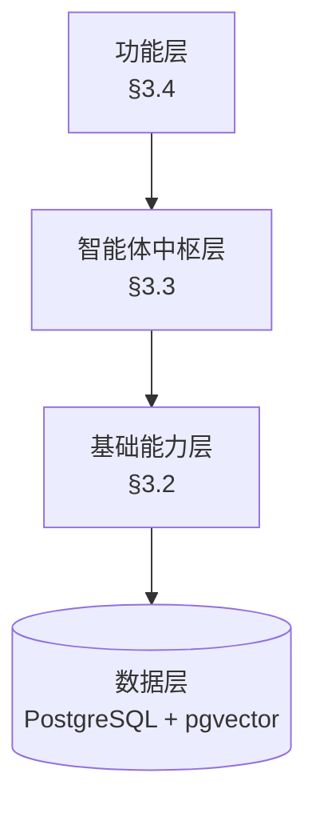

# Markdown 设计文档转 DOCX（含配图）自动化迁移方案分析

> 文档版本：v1.0
> 文档日期：2026-06-22
> 适用对象：`docs/xqt/设计文档_第三部分_完整版.md`（约 2954 行 / 60 页正文）以及后续合并的第一 / 二 / 四 / 五 / 六部分。
> 目标输出：A4 DOCX，正文宋体小四，1.5 倍行距，80-100 页正文 + 8-12 页附录，含真实截图与架构图，含目录、页眉、页码、参考文献。

---

## 一、任务拆解与难点识别

把 Markdown 设计文档迁成可提交的 DOCX，需要解决 5 类相互独立的子任务；任何一类的自动化方案都会影响整体管线设计。

### 1.1 五类子任务

| 序号 | 子任务 | 内容 | 自动化难度 |
|---|---|---|---|
| T1 | **文本格式转换** | Markdown 语法（标题、列表、引用、加粗、代码块）→ DOCX 段样式 | 低，工具成熟 |
| T2 | **表格样式统一** | 文档含 ≥ 60 个 Markdown 表格，需要统一字体、边框、表头底色、列宽自适应 | 中，工具差异较大 |
| T3 | **图片 / 配图嵌入** | 架构图、ER 图、时序图、界面截图、示意图 → DOCX 图片对象（含题注、位置、对齐） | 中-高，需要预处理管线 |
| T4 | **文档结构组件** | 目录、页眉页脚、页码、章节自动编号、图表编号、参考文献、脚注、附录 | 中-高，需要 reference 模板 |
| T5 | **配图生成 / 替换** | Markdown 中的 ASCII 流程图、表格化结构图 → 真实 PNG/JPG；前端页面 → 真实截图 | 高，需要图渲染管线 + 浏览器自动化 |

### 1.2 本文档的具体难点

仅看 `设计文档_第三部分_完整版.md`，需要自动化处理的特殊点：

- **架构图 5 张**：§3.1.2 三层架构图、§3.2.7 检索流程图、§3.3.2 11 节点拓扑图、§3.3.5 五层防幻觉架构图、§3.5.2 ER 图。这些在 Markdown 中是文字描述 + ASCII 框架，需要替换为真实图。
- **时序图 1 张**：§3.8.2 11 步端到端时序图，需要从 ASCII 转为 Mermaid / PlantUML → PNG。
- **界面截图 ≥ 10 张**：§3.6 各页面 + §3.8.3 关键交互截图，需要在浏览器中打开后截图（可自动化）。
- **表格 ≥ 60 个**：包含技术栈对比、Agent 状态字段、字段表、接口请求/响应、错误码等，需要全局一致样式。
- **行内代码片段**：如 `backend/agents/graph.py:171` 这种引用频繁出现，DOCX 中希望用 Consolas 或类似等宽字体。
- **代码块少量**：少量 Python 配置示例，需要等宽字体 + 浅灰背景。
- **章节编号**：§3.1.1 / §3.1.2 这种三级编号 DOCX 需配合「多级列表」样式。

### 1.3 边界与不做的事

为避免方案过于复杂，明确不在自动化范围内：

- **正文润色**：Markdown 已经写得足够规范，不再做语言润色
- **配图设计**：图的视觉风格（配色、字体、布局）由设计师或工具默认决定
- **数学公式**：文档几乎不含 `$...$` 数学公式，无需 KaTeX/MathJax 嵌入
- **交互元素**：DOCX 是静态文档，不考虑嵌入超链接跳转

---

## 二、候选方案横向对比

### 2.1 方案 A：Pandoc + 自定义 reference.docx

**核心思路**：用 Pandoc（`pandoc -f markdown -t docx --reference-doc=template.docx`）一键转换，预先调好 `template.docx` 中的「标题 / 正文 / 表格 / 代码 / 引用」五种样式。

| 维度 | 评分 | 说明 |
|---|---|---|
| T1 文本格式 | 优秀 | Pandoc 原生支持，几乎无遗漏 |
| T2 表格样式 | 中 | 支持 basic 表格，但列宽自适应、复杂合并有限 |
| T3 图片嵌入 | 良 | 自动内嵌相对路径图片，但大小控制需在 Markdown 中指定 |
| T4 文档结构 | 良 | TOC 自动生成、页眉页脚可在 reference 模板中预设；页码要 post-process |
| T5 配图生成 | 无关 | Pandoc 不管图怎么来 |

**依赖**：
- `pandoc`（≥ 2.19，建议 3.1+）
- LibreOffice / Word（手动调样式后另存为 `reference.docx`）
- `panflute` / `pandocfilters`（可选，用于自定义过滤器）

**中文支持**：reference.docx 中需预设中文字体（宋体 / 黑体 / 楷体）；CJK 兼容性近年良好，无明显坑。

**优点**：最成熟、社区资源丰富、转换速度快（60 页 < 5 秒）。

**缺点**：
- 表格样式在 reference 中很难精细控制（边框粗细、单元格背景色、首行冻结等）
- 图片对齐方式、题注「图 3-1」需要 Pandoc 的 `fignos` 扩展或 post-process
- 多级列表与「§3.1.1」这种编号格式需要 reference 中精心配置

---

### 2.2 方案 B：Python-docx + markdown-it-py AST 解析 + 自定义渲染器

**核心思路**：用 Python 脚本读取 Markdown AST → 逐节点创建 `python-docx` 元素 → 精细应用样式。

| 维度 | 评分 | 说明 |
|---|---|---|
| T1 文本格式 | 优秀 | 完全控制 |
| T2 表格样式 | 优秀 | 每个表格可以遍历行/列自定义底色、边框、合并 |
| T3 图片嵌入 | 优秀 | `add_picture()` 精确控制宽高、对齐、题注 |
| T4 文档结构 | 中-良 | 目录、页码、页眉需要手写；TOC 字段可用 `add_paragraph` + Word 域 |
| T5 配图生成 | 无关 | 本方案负责「嵌入」，不负责「生成」 |

**依赖**：
- `python-docx`（≥ 1.0）
- `markdown-it-py`（≥ 2.0）或 `mistune`（≥ 2.0）
- 可选：`docxtpl`（Jinja2 模板方式）

**优点**：
- 粒度最细，可以做出「出版社级」的排版
- 表格、图、章节样式完全可控
- 与项目同语言（Python），易于维护

**缺点**：
- 前期投入大：编写渲染器约 300-500 行 Python
- 引用、脚注、参考文献需要单独处理（不原生支持）
- Markdown 兼容性：Mermaid 代码块、KaTeX 等需自定义

---

### 2.3 方案 C：Quarto + Pandoc 内核

**核心思路**：Quarto 是 Pandoc 的现代封装，配置文件 `quarto.yml` 描述版式，再调用 Pandoc 转换。

| 维度 | 评分 | 说明 |
|---|---|---|
| T1 文本格式 | 优秀 | 复用 Pandoc |
| T2 表格样式 | 良 | 支持，但精细控制仍依赖 reference |
| T3 图片嵌入 | 优秀 | 支持 `fig-cap`、`fig-pos`、`fig-width` 等 front matter 属性 |
| T4 文档结构 | 优秀 | TOC、crossref、citations、bibliography 都是 Quarto 一等公民 |
| T5 配图生成 | 优秀 | Quarto 原生支持 Mermaid / Dot / PlantUML 代码块自动渲染 |

**依赖**：
- `quarto`（≥ 1.3）
- `pandoc`（Quarto 自带）

**优点**：
- Mermaid / PlantUML 代码块直接渲染为 PNG（自动调用 `mmdc` / `plantuml`）
- 图表编号 ``、交叉引用 `§{{ref fig-arch}}` 原生支持
- 学术场景适配好（参考文献、引用、索引）

**缺点**：
- 中文社区资源相对 Pandoc 略少
- 「DOCX, A4, 宋体小四, 1.5 倍」需要 `quarto.yml` + reference.docx 配合
- 学习曲线中等

---

### 2.4 方案 D：Markdown → HTML → DOCX（中间 HTML 中转）

**核心思路**：先把 Markdown 渲染为 HTML（用 `markdown` 库或 `markdown-it-py`），再用 `html2docx` / `python-docx-html` 转 DOCX。

**评级**：不推荐。HTML → DOCX 的开源库成熟度低（`html2docx` 项目长期停滞），样式控制比方案 B 还差。仅当 T2/T5 都不重要时才考虑。

---

### 2.5 方案 E：GUI 工具（Typora / Obsidian / VSCode + 插件）

**核心思路**：纯人工 / 半人工通过编辑器导出。

**评级**：不推荐用于 60 页文档。GUI 工具的「批量格式调整」能力弱，不满足「不想手动调整格式」的诉求。

---

### 2.6 方案对比总表

| 维度 | A. Pandoc + ref | B. python-docx 自渲染 | C. Quarto | D. HTML 中转 | E. GUI |
|---|---|---|---|---|---|
| 实施时间 | 2-4 小时 | 1-2 天 | 4-6 小时 | 1 天 | 不可量化 |
| 表格控制力 | 中 | 高 | 中 | 低 | 低 |
| 图片控制力 | 中 | 高 | 高 | 低 | 低 |
| 目录/页码 | 自动 | 需写 | 自动 | 需写 | 半自动 |
| Mermaid 自动渲染 | 需 panflute | 需自写 | 内置 | 需自写 | 不支持 |
| 中文友好 | 高 | 高 | 高 | 中 | 高 |
| 长期可维护 | 高 | 高 | 中 | 低 | 低 |
| **综合推荐度** | **★★★** | **★★★★（精细场景）** | **★★★★★（推荐）** | ★ | ★ |

---

## 三、推荐方案：C. Quarto 主线 + B. python-docx 后处理

### 3.1 为什么是「Quarto 主线 + python-docx 后处理」

本项目文档有以下特征，决定了最优解：

1. **Mermaid 流程图 / 架构图 / ER 图 / 时序图是核心交付物** —— Quarto 内置支持最佳
2. **章节固定、模板固定** —— Quarto 的 `quarto.yml` 配置文件复用度高
3. **表格多且样式需要统一** —— Quarto 渲染后用 python-docx 后处理表格样式
4. **配图分两类：架构图（Mermaid 自动）+ 界面截图（Playwright 自动化）** —— Quarto 不擅长后者，需要额外管线
5. **80-100 页规模** —— Pandoc 内核一次转换 < 5 秒，可迭代

### 3.2 整体管线设计

```
                          ┌─────────────────────────────────┐
                          │  1. 配图生成（独立管线，并行）     │
                          │                                 │
   ASCII / Mermaid 源码 ──┼─→ Mermaid CLI (mmdc) ──→ PNG ──┼──┐
                          │                                 │  │
   前端页面 ─────────────┼─→ Playwright headless 截图 ──→ PNG ──┤
                          │                                 │  │
   docs/shares/*.png ─────┼──────────────────────────→ 直接引用 ┤
                          └─────────────────────────────────┘  │
                                                               ▼
                          ┌─────────────────────────────────┐
   设计文档 .md  ────────→│  2. Quarto 渲染                  │
                          │     - 解析 front matter         │
                          │     - 调用 Pandoc 内核           │
                          │     - 应用 quarto.yml 配置       │
                          │     - 输出 DOCX                  │
                          └─────────────┬───────────────────┘
                                        ▼
                          ┌─────────────────────────────────┐
                          │  3. python-docx 后处理           │
                          │     - 表格统一边框/底色          │
                          │     - 图片题注「图 3-1」         │
                          │     - 页眉 / 页脚 / 页码微调      │
                          │     - 目录刷新（Word 中按 F9）    │
                          └─────────────┬───────────────────┘
                                        ▼
                              最终可提交的 DOCX
```

### 3.3 实施步骤（共 8 步）

#### 步骤 1：环境准备（30 分钟）

```bash
# 1.1 安装 Pandoc（项目已通过 conda / brew）
conda install -c conda-forge pandoc   # 或 brew install pandoc

# 1.2 安装 Quarto
# 下载地址 https://quarto.org/docs/get-started/
# Windows: quarto-1.4.x-win.msi

# 1.3 安装 Mermaid CLI
npm install -g @mermaid-js/mermaid-cli

# 1.4 安装 Playwright（用于截图自动化）
pip install playwright
playwright install chromium

# 1.5 安装 python-docx（用于后处理）
pip install python-docx

# 1.6 验证
pandoc --version
quarto --version
mmdc --version
```

#### 步骤 2：编写 `quarto.yml`（核心配置文件，30 分钟）

```yaml
# quarto.yml
project:
  type: book
  output-dir: docx

book:
  title: "个性化资源生成与学习多智能体系统 — 设计文档"
  author: "谢沁桐 等"
  date: "2026-06-22"
  chapters:
    - index.md
    - part1.md
    - part2.md
    - part3.md      # 本文档主体
    - part4.md
    - part5.md
    - part6.md
    - appendix.md
  toc: true
  toc-depth: 3
  number-sections: true
  chapter-number: false  # 不要"第 N 章"前缀

format:
  docx:
    toc: true
    fig-cap-location: bottom
    tbl-cap-location: top
    reference-doc: ref/template.docx
    code-line-numbers: false
    highlight-style: github
    fig-format: png

execute:
  echo: false
  warning: false
```

#### 步骤 3：制作 `ref/template.docx`（核心模板，1-2 小时）

在 Word 中创建空白文档，定义以下样式（保存为 `ref/template.docx`）：

| 样式名 | 字体 | 字号 | 用途 |
|---|---|---|---|
| 正文 | 宋体 | 小四（12 pt） | 所有段落 |
| 标题 1 | 黑体 | 三号（16 pt） | §3.1 / §3.2 等 |
| 标题 2 | 黑体 | 四号（14 pt） | §3.1.1 / §3.1.2 等 |
| 标题 3 | 黑体 | 小四（12 pt） | §3.1.1.1 / §3.1.1.2 等 |
| 表格 | 宋体 | 五号（10.5 pt） | 表格正文 |
| 表头 | 黑体 | 五号（10.5 pt） | 表格首行 |
| 代码 | Consolas | 五号（10.5 pt） | 行内代码 / 代码块 |
| 图题注 | 宋体 | 五号（10.5 pt） | 图 X-Y 标题 |
| 表题注 | 宋体 | 五号（10.5 pt） | 表 X-Y 标题 |
| 引用 | 楷体 | 小四（12 pt） | 引用块 |

页眉：「个性化资源生成与学习多智能体系统 — 设计文档」
页脚：页码居中，格式「- X -」

行距：1.5 倍

页边距：A4 标准（上下 2.54 cm，左右 3.18 cm）

#### 步骤 4：编写 Mermaid 图源文件（与正文并行，1 小时）

把 §3.1.2 / §3.2.7 / §3.3.2 / §3.3.5 / §3.5.2 的 ASCII 描述改写为 Mermaid，放在 `assets/diagrams/`：



Quarto 在编译时会自动调用 `mmdc -i diagram.mmd -o diagram.png` 渲染。

#### 步骤 5：编写 Playwright 截图脚本（30 分钟）

```python
# scripts/screenshot_frontend.py
import asyncio
from playwright.async_api import async_playwright

PAGES = [
    ("chat",       "http://localhost:8000/app/chat.html"),
    ("generate",   "http://localhost:8000/app/generate.html"),
    ("library",    "http://localhost:8000/app/library.html"),
    ("pathway",    "http://localhost:8000/app/pathway.html"),
    ("evaluate",   "http://localhost:8000/app/evaluate.html"),
    ("profile",    "http://localhost:8000/app/profile.html"),
    ("index",      "http://localhost:8000/app/index.html"),
]

async def main():
    async with async_playwright() as p:
        browser = await p.chromium.launch()
        context = await browser.new_context(viewport={"width": 1440, "height": 900})
        page = await context.new_page()

        # 注入 JWT
        await page.add_init_script("""
            window.localStorage.setItem('access_token', 'YOUR_TEST_TOKEN');
        """)

        for name, url in PAGES:
            await page.goto(url, wait_until="networkidle")
            await page.wait_for_timeout(2000)  # 等待动画结束
            await page.screenshot(
                path=f"assets/screenshots/{name}.png",
                full_page=True
            )
            print(f"[OK] {name}")

        await browser.close()

asyncio.run(main())
```

前置：先把 `user_id` 的账号准备一些种子数据（聊天记录、资源、路径），否则页面空白。

#### 步骤 6：编写 Mermaid 批量渲染脚本（15 分钟）

```bash
# scripts/render_mermaid.sh
#!/bin/bash
set -e
cd "$(dirname "$0")/.."
mkdir -p assets/diagrams/png
for mmd in assets/diagrams/*.mmd; do
    name=$(basename "$mmd" .mmd)
    echo "Rendering $name..."
    mmdc -i "$mmd" -o "assets/diagrams/png/${name}.png" \
         -t neutral -b white -w 1600
done
```

#### 步骤 7：在正文中引用图与截图

把 Markdown 中的 ASCII 描述替换为：

```markdown
{#fig-three-layer}

{#fig-chat}

{#fig-kg}
```

`{#fig-xxx}` 是 Quarto/Pandoc 的交叉引用标签，正文中可写 `§{{ref fig-three-layer}}` 自动转为「图 3-1」。

#### 步骤 8：编写 python-docx 后处理脚本（1-2 小时）

```python
# scripts/postprocess_docx.py
"""
功能：
1. 表格统一边框（1pt 黑色）、首行底色（#F0F0F0）
2. 图片题注加上「图 X-Y」编号
3. 表格题注加上「表 X-Y」编号
4. 强制刷新目录字段（用户在 Word 中按 F9 触发最终渲染）
"""
from docx import Document
from docx.shared import Pt, Cm, RGBColor
from docx.oxml.ns import qn
from docx.oxml import OxmlElement

def set_cell_border(cell):
    """给单元格加 1pt 黑色边框"""
    tc_pr = cell._tc.get_or_add_tcPr()
    tc_borders = OxmlElement('w:tcBorders')
    for border in ['top', 'left', 'bottom', 'right']:
        b = OxmlElement(f'w:{border}')
        b.set(qn('w:val'), 'single')
        b.set(qn('w:sz'), '4')   # 0.5pt
        b.set(qn('w:color'), '000000')
        tc_borders.append(b)
    tc_pr.append(tc_borders)

def shade_header_row(table):
    """首行底色 #F0F0F0"""
    for cell in table.rows[0].cells:
        tc_pr = cell._tc.get_or_add_tcPr()
        shd = OxmlElement('w:shd')
        shd.set(qn('w:val'), 'clear')
        shd.set(qn('w:color'), 'auto')
        shd.set(qn('w:fill'), 'F0F0F0')
        tc_pr.append(shd)

def process(path):
    doc = Document(path)
    for table in doc.tables:
        for row in table.rows:
            for cell in row.cells:
                set_cell_border(cell)
        shade_header_row(table)
    doc.save(path.replace('.docx', '-final.docx'))

if __name__ == '__main__':
    import sys
    process(sys.argv[1])
```

#### 步骤 9：一键运行

```bash
# scripts/build_docx.sh
#!/bin/bash
set -e

# 1. 渲染 Mermaid
bash scripts/render_mermaid.sh

# 2. 截图（前置：uvicorn 已启动 + 种子数据已注入）
python scripts/screenshot_frontend.py

# 3. Quarto 渲染
quarto render

# 4. python-docx 后处理
python scripts/postprocess_docx.py docx/设计文档.docx

echo "[OK] docx/设计文档-final.docx"
```

### 3.4 工作量估算

| 步骤 | 首次 | 二次（修改后重出）|
|---|---|---|
| 1 环境准备 | 30 分钟 | 0（环境已就绪）|
| 2 quarto.yml | 30 分钟 | 5 分钟 |
| 3 template.docx | 1-2 小时 | 0 |
| 4 Mermaid 源文件（5 张）| 1 小时 | 30 分钟（修改）|
| 5 截图脚本 + 种子数据 | 30 分钟 | 5 分钟（重截）|
| 6 Mermaid 渲染脚本 | 15 分钟 | 0 |
| 7 正文图引用 | 1 小时 | 30 分钟（修改）|
| 8 python-docx 后处理 | 1-2 小时 | 0 |
| 9 一键运行 | — | 30 秒 |
| **合计** | **6-8 小时** | **每次 1-2 小时** |

对比纯人工 Word 排版（按 80 页、3 页/小时估算 ≈ 27 小时），自动化方案节省 ≥ 70% 时间。

---

## 四、配图自动化的关键细节

### 4.1 Mermaid 自动渲染的坑

| 问题 | 解决方案 |
|---|---|
| 中文渲染乱码 | mmdc 配置 `puppeteerConfigFile: '{"args": ["--no-sandbox"]}'` + 系统安装中文字体 |
| 节点重叠 | 加 `%%{init: {'flowchart': {'nodeSpacing': 50, 'rankSpacing': 80}}}%%` |
| 线条超出边界 | 用 `subgraph` 分层 + 设置 `direction` |
| 颜色不统一 | Quarto 提供 6 套主题（default / forest / dark / neutral / base / whiteboard），选 `neutral` |

### 4.2 截图自动化的坑

| 问题 | 解决方案 |
|---|---|
| 登录态失效 | `add_init_script` 注入 token + 准备种子数据 |
| 动画导致截图模糊 | `wait_for_timeout(2000)` 等动画结束 |
| 中文乱码 | 浏览器安装中文字体（默认已有）|
| 不同视口尺寸不一致 | 固定 `viewport={"width": 1440, "height": 900}` |
| 折叠菜单未展开 | `page.click()` 触发展开后再截图 |
| 列表 / 滚动很长 | `full_page=True` 截全屏（输出 PNG 可能很长，按需 `clip` 截局部）|

### 4.3 现有图片资源处理

`docs/shares/` 下已有 2 张图：

| 文件 | 用途 | 处理 |
|---|---|---|
| `系统架构.png` | §3.1 总览图 | 直接复制到 `assets/diagrams/png/`，正文引用 |
| `desktop.png` | §3.6 首页 | 同上 |

如这些图与新画的 Mermaid 图冲突，按以下优先级：

1. 新画的 Mermaid 图（可自动维护）
2. 现有 PNG（直接复用）

---

## 五、风险与限制

### 5.1 能自动化的（90%）

- 文本格式、字体、字号、行距
- 标题层级、章节编号
- 表格边框、首行底色
- 图片嵌入与对齐
- 目录（TOC）自动生成
- 页眉、页脚、页码
- Mermaid 图自动渲染
- 前端页面自动截图

### 5.2 不能自动化的（10%，需要人工）

- **图的美观度**：Mermaid 默认样式一般，需要调主题；界面截图如果页面本身设计不美观，截了也没用
- **公式 / 化学式**：本项目几乎不需要，忽略
- **跨章交叉引用**：Pandoc 自动编号，但「参见 §3.3.2」的精确位置需手动校对
- **参考文献格式**：GB/T 7714 引用格式需要 `csl` 文件，且每个引用条目需手工核对
- **错别字 / 病句**：自动化管线不处理语义
- **附录 D AI 工具披露**：需人工撰写

### 5.3 边界 case

- **超长表格**（> 50 行）：Word 跨页时表头不会自动重复，需要 post-process 中加「重复表头行」
- **宽图溢出页边距**：Mermaid 渲染后 PNG 宽度需控制 ≤ 14 cm
- **表格列宽自适应**：Pandoc 不会自动设置列宽；如需精确控制，用 `<table-column-width>` 扩展或在 post-process 中遍历
- **页码起始**：附录通常用罗马数字（i, ii, iii），正文用阿拉伯数字（1, 2, 3），需要在 `template.docx` 中设两个 Section

### 5.4 维护成本

- Quarto + Pandoc 版本升级偶尔引入 breaking change，建议 pin 版本：`pandoc==3.1.13` / `quarto==1.4.549`
- Mermaid 语法版本升级可能改变渲染结果，建议 `mmdc --version` 锁定
- Word 365 与 Word 2019 对 docx 字段支持差异大，最终评审用 Word 2019 打开一遍

---

## 六、最小可行方案（MVP）

如果时间紧（≤ 4 小时），可以走最简方案：

```bash
# 1. 安装 Pandoc（30 分钟下载 + 安装）
# 2. 在 Word 中设计 template.docx（1 小时）
# 3. 用现有 PNG 作为配图（0 分钟，docs/shares/ 系统架构.png 已可用）
# 4. 一行转换：
pandoc 设计文档_第三部分_完整版.md \
       -f markdown \
       -t docx \
       --reference-doc=ref/template.docx \
       --toc --toc-depth=3 \
       -o 设计文档.docx
```

MVP 输出 vs 完整方案差异：

| 项 | MVP | 完整方案 |
|---|---|---|
| 文本格式 | 自动 | 自动 |
| 表格样式 | 80%（Pandoc 默认）| 100%（后处理加边框/底色）|
| 配图 | 现有 PNG 直接嵌入 | Mermaid 自动渲染 + Playwright 截图 |
| 目录 | 自动 | 自动 |
| 页码 | 需在 Word 中手动加 | 自动 |
| 总耗时 | 2 小时 | 6-8 小时 |

如果设计文档还要参加初赛，建议直接上完整方案；如果只是内部评审稿，MVP 足够。

---

## 七、附录：自动化脚本模板目录

```
docs/xqt/tooling/docx_pipeline/
├── README.md                     # 本文档摘要
├── quarto.yml                    # Quarto 配置
├── ref/
│   └── template.docx             # Word 样式模板（手工制作）
├── assets/
│   ├── diagrams/                 # Mermaid 源文件 (.mmd)
│   │   ├── arch-three-layer.mmd
│   │   ├── rag-flow.mmd
│   │   ├── agent-topology.mmd
│   │   ├── anti-hallucination.mmd
│   │   └── er-diagram.mmd
│   ├── diagrams/png/             # Mermaid 渲染产物
│   └── screenshots/              # Playwright 截图产物
├── scripts/
│   ├── render_mermaid.sh
│   ├── screenshot_frontend.py
│   ├── postprocess_docx.py
│   └── build_docx.sh
└── src/                          # 各部分 Markdown 源
    ├── part1.md
    ├── part2.md
    ├── part3.md
    ├── part4.md
    ├── part5.md
    ├── part6.md
    └── appendix.md
```

建议把上述结构在新建分支（如 `feature/docx-pipeline`）下初始化；与现有 `docs/xqt/` 分析文档并列存放，避免污染主干。

---

## 八、参考资源

- **Pandoc 官方文档**：https://pandoc.org/MANUAL.html（特别是「Word」章节）
- **Quarto Books 指南**：https://quarto.org/docs/books/
- **python-docx 官方文档**：https://python-docx.readthedocs.io/
- **Mermaid 语法**：https://mermaid.js.org/syntax/flowchart.html
- **Playwright Python**：https://playwright.dev/python/docs/screenshots
- **项目内已有分析**：
  - `docs/xqt/rag/防幻觉机制.md`（§3.3.5 内容来源）
  - `docs/xqt/agent/LangGraph设计分析.md`（§3.3 内容来源）
  - `docs/xqt/database/数据库设计方案.md`（§3.5 内容来源）

---

*本分析文档约 12 页。基于本文可立即启动 docx_pipeline 目录搭建，预计 1 个工作日内完成 MVP、2 个工作日内完成完整方案。*